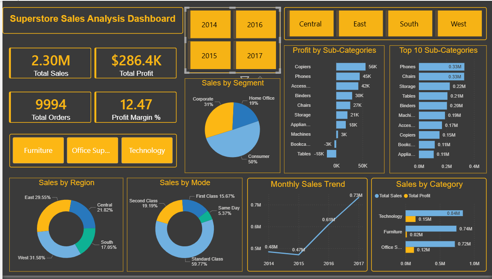

# 🛒 Superstore Sales Analysis Project



## 📌 Project Overview
Comprehensive analysis of **9,994 US Superstore retail transactions** to uncover sales trends, profitability insights, and customer segmentation patterns using **Excel, MySQL, and Power BI**.

---

## 🛠️ Tools & Technologies

| Tool | Purpose |
|------|---------|
| 📊 Microsoft Excel | Data Cleaning, Pivot Tables & Charts |
| 🗄️ MySQL Workbench | 10 Advanced SQL Queries |
| 📈 Power BI Desktop | Interactive 2-Page Dashboard |

---

## 📊 Dataset Information
- **Source:** [Kaggle Superstore Dataset](https://www.kaggle.com/datasets/vivek468/superstore-dataset-final)
- **Total Records:** 9,994 orders
- **Time Period:** 2014 - 2017
- **Region:** United States
- **Columns:** 21 (+ 2 calculated columns)

---

## 📁 Repository Structure

```
superstore-sales-analysis/
│
├── 📁 Excel/
│   ├── sup_du_clean.xlsx          → Cleaned Excel file with Pivot Tables & Charts
│   └── screenshots/
│       ├── Pivot_table_1.png      → Sales by Region
│       ├── Pivot_table_2.png      → Sales by Category
│       ├── Pivot_table_3.png      → Top 10 Sub-Categories
│       └── Pivot_table_4.png      → Monthly Sales Trend
│
├── 📁 SQL/
│   └── superstore_queries.sql     → 10 Business SQL Queries
│
├── 📁 PowerBI/
│   ├── superstore_dashboard.pbix  → Power BI Dashboard File
│   └── Superstore_screenshot.png  → Dashboard Screenshot
│
├── 📁 Data/
│   └── superstore_mysql.csv       → Cleaned CSV Data File
│
└── 📄 README.md
```

---

## 📈 Phase 1 — Excel Analysis

### Data Cleaning Steps:
- ✅ Removed duplicate records
- ✅ Fixed inconsistent date formats
- ✅ Converted text columns to proper data types
- ✅ Fixed Postal Code leading zeros
- ✅ Verified null values

### Calculated Columns Added:
| Column | Formula | Purpose |
|--------|---------|---------|
| Profit Margin % | (Profit/Sales) × 100 | Measure profitability |
| Days to Ship | Ship Date - Order Date | Measure delivery efficiency |

### Pivot Tables Created:
| # | Pivot Table | Insight |
|---|-------------|---------|
| 1 | Sales by Region | West leads with $725K |
| 2 | Sales by Category | Technology highest at $836K |
| 3 | Top 10 Sub-Categories | Phones & Chairs top sellers |
| 4 | Monthly Sales Trend | Nov-Dec always peak months |

---

## 🗄️ Phase 2 — SQL Analysis

### 10 Business Queries:

| # | Query | SQL Concepts Used |
|---|-------|-------------------|
| 1 | Total Sales & Profit | SUM, ROUND |
| 2 | Sales by Region | GROUP BY, ORDER BY |
| 3 | Sales by Category | GROUP BY, COUNT |
| 4 | Top 10 Customers | LIMIT |
| 5 | Loss Making Products | HAVING |
| 6 | Monthly Sales Trend | YEAR(), MONTH(), MONTHNAME() |
| 7 | Top 10 Products | Multiple GROUP BY |
| 8 | Region Rankings | RANK(), PARTITION BY |
| 9 | Year over Year Growth | LAG(), Subquery |
| 10 | Customer Segmentation | COUNT DISTINCT, AVG |

---

## 📊 Phase 3 — Power BI Dashboard

### DAX Measures Created:
```dax
Total Sales = SUM(superstore_mysql[Sales])
Total Profit = SUM(superstore_mysql[Profit])
Profit Margin % = DIVIDE(SUM(Profit), SUM(Sales)) * 100
Total Orders = COUNTROWS(superstore_mysql)
Avg Order Value = DIVIDE(SUM(Sales), COUNTROWS(superstore_mysql))
```

### Page 1 — Sales Overview:
- 📦 4 KPI Cards (Sales, Profit, Orders, Margin %)
- 🍩 Donut Chart — Sales by Region
- 📈 Line Chart — Monthly Sales Trend
- 📊 Bar Chart — Sales vs Profit by Category
- 🎛️ Slicers — Region, Category, Year

### Page 2 — Product Analysis:
- 📊 Bar Chart — Top 10 Sub-Categories by Sales
- 📊 Bar Chart — Profit by Sub-Category
- 🥧 Pie Chart — Sales by Customer Segment
- 🍩 Donut Chart — Sales by Ship Mode
- 🎛️ Slicers — Region, Category, Year

---

## 🔍 Key Findings & Insights

### 💰 Sales Performance:
- **Total Sales:** $2.3M | **Total Profit:** $286.4K
- **Profit Margin:** 12.47%
- **Best Region:** West → $725,457 (31.58%)
- **Best Category:** Technology → $836,154

### 📉 Loss Making Products:
| Sub-Category | Loss |
|-------------|------|
| Tables | -$17,725 |
| Bookcases | -$3,472 |
| Supplies | -$1,189 |

### 📈 Growth Trend:
| Year | Sales | Growth |
|------|-------|--------|
| 2014 | $484K | - |
| 2015 | $470K | -2.83% |
| 2016 | $609K | +29.47% |
| 2017 | $733K | +20.36% |

### 👥 Customer Segments:
| Segment | Sales Share |
|---------|------------|
| Consumer | 50% |
| Corporate | 31% |
| Home Office | 19% |

---

## 💡 Business Recommendations

1. 🎯 **Focus on West region** — highest sales and growth potential
2. ❌ **Stop discounting Tables** — making -$17K loss every year
3. 💻 **Invest in Technology** — highest profit margin category
4. 👥 **Target Consumer segment** — 50% of total sales
5. 📦 **Promote Standard Class** — most popular shipping at 59.77%
6. 📅 **Increase inventory for Nov-Dec** — always peak sales months

---

## 🖼️ Dashboard Preview


---

## 👤 Author

**Dushyant**
- 🐙 GitHub: [github.com/mtechgoel16](https://github.com/mtechgoel16)

---

## ⭐ If you found this project helpful, please give it a star!
